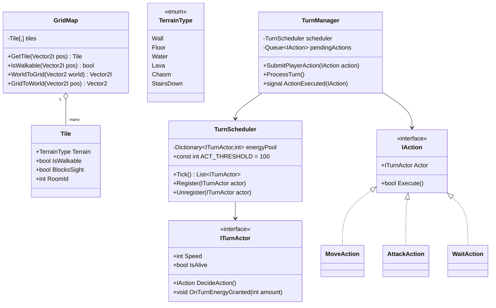
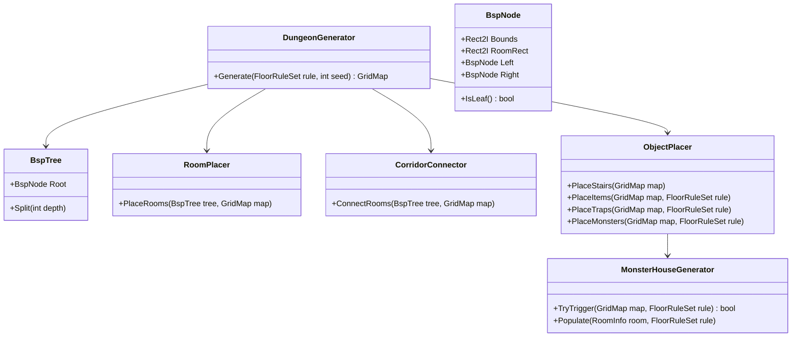
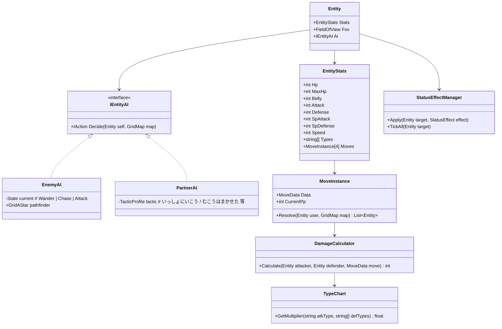
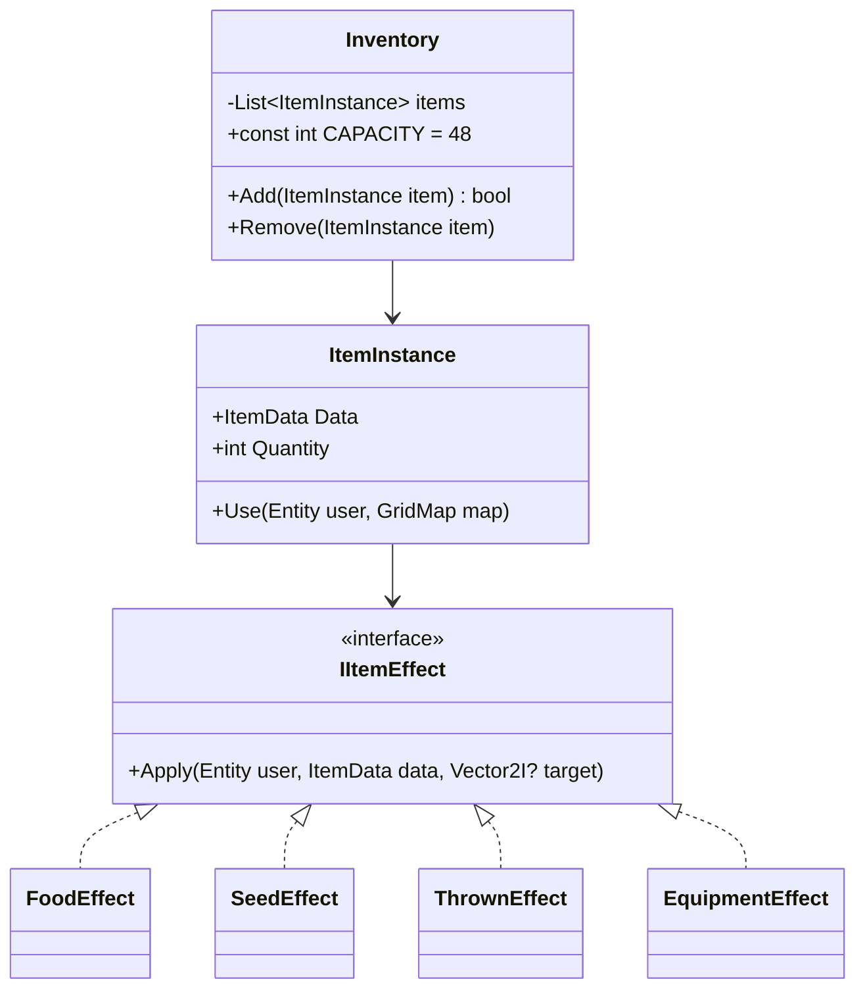

# 不思議のダンジョン系ローグライク 全体アーキテクチャ設計

対象: 『ポケモン 不思議のダンジョン 空の探検隊』相当の深さを持つ、Windows/Android向け2Dローグライク。

## 0. 技術選定

| 項目 | 選定 | 理由 |
|---|---|---|
| エンジン | **Godot Engine 4.x** | 完全無料・オープンソース。2Dグリッドローグライクとの相性が良く、Android/Windowsへの書き出しが軽量。ロイヤリティ・ライセンス条件を気にせず配布できる。 |
| スクリプト言語 | **C# (.NET)** | フェーズ3〜5で要求される「作戦ベースのステートマシン」「技のレンジ計算」「アイテム効果のストラテジーパターン」等、インターフェース/ジェネリクスを多用する中〜大規模アーキテクチャでは、GDScriptよりC#の静的型付けの方が保守性・IDE支援に優れるため。Godot 4のC#サポートは実用レベルに到達している。 |
| データ形式 | **JSON**（一部テーブル系はCSVも許容） | モンスター・技・アイテム・ダンジョン生成ルールを完全にソースコード外に分離。 |
| バージョン管理 | Git | 既存リポジトリを使用。 |

> 注: GDScriptへの変更は容易（データ駆動設計そのものはエンジン非依存）。この提案が承認された時点でC#前提の雛形を作成します。異論があればフェーズ1着手前にお知らせください。

---

## 1. 設計方針（全フェーズ共通）

1. **データ駆動**: ステータス・技・アイテム・ダンジョン生成ルールは全てJSONに外出しし、`Data/` 配下の起動時ローダーが `Database`（Autoloadシングルトン）にロードする。ゲームロジックは常にID経由でデータを参照し、直書きしない。
2. **疎結合**: モジュール間の直接参照を避け、以下の手段で結合度を下げる。
   - **EventBus (Autoload)**: Godotシグナルを中継するグローバルバス。戦闘・UI・AIはイベント発行/購読のみで連携し、相互に型参照しない。
   - **インターフェース分離**: `ITurnActor`, `IEntityAI`, `IItemEffect` などのインターフェースを介して、TurnManager/AI/アイテムシステムが実装詳細を知らずに済むようにする。
   - **Godotノード合成**: `Entity` は巨大な単一クラスにせず、`EntityStats` / `EntityMover` / `EntityAI` / `EntityInventory(Held Item)` などの子ノード（コンポーネント）に分割する。
3. **コマンド/アクションパターン**: プレイヤー・NPCの行動は全て `IAction`（`MoveAction`, `AttackAction`, `UseMoveAction`, `UseItemAction`, `WaitAction` 等）にカプセル化し、`TurnManager` が実行・ログ記録・巻き戻し（デバッグ用）を一元管理できるようにする。
4. **テスト容易性**: 乱数は `RNGService`（シード可能）に集約し、ダンジョン生成・命中判定などを再現可能にする。GUT（Godot Unit Test）等でロジック層（Grid/Turn/Combat/Dungeon生成）を単体テスト可能にする。

---

## 2. ディレクトリ構成案

```
/ (repo root)
├─ docs/
│  └─ architecture/ARCHITECTURE.md          ← 本ドキュメント
├─ project.godot
├─ Data/                                    # データ駆動パラメータ（JSON）
│  ├─ monsters.json
│  ├─ moves.json
│  ├─ items.json
│  ├─ dungeons.json
│  ├─ type_chart.json
│  └─ status_effects.json
├─ Assets/
│  ├─ Sprites/{Monsters,Tiles,UI,Items}/
│  ├─ Audio/{BGM,SE}/
│  └─ Fonts/
├─ Scenes/
│  ├─ Main.tscn
│  ├─ Dungeon/{DungeonRoot.tscn, TileVisual.tscn}
│  ├─ Entities/{Player.tscn, Enemy.tscn, Partner.tscn}
│  └─ UI/{HUD.tscn, MessageLog.tscn, Minimap.tscn, InventoryScreen.tscn, MoveMenu.tscn}
└─ Scripts/                                 # C#
   ├─ Core/
   │  ├─ GameManager.cs                     # Autoload: ゲーム全体の状態遷移（タイトル/ダンジョン内/結果画面）
   │  ├─ EventBus.cs                        # Autoload: 疎結合イベント中継
   │  └─ RNGService.cs                      # Autoload: シード可能な乱数
   ├─ Data/
   │  ├─ DataLoader.cs                      # JSON→POCOデシリアライズ
   │  ├─ Database.cs                        # Autoload: ID引きの読み取り専用データストア
   │  └─ Schemas/
   │     ├─ MonsterData.cs / MoveData.cs / ItemData.cs / DungeonData.cs / TypeChartData.cs
   ├─ Grid/                                 # フェーズ1
   │  ├─ GridMap.cs                         # Tile[,] と座標変換
   │  ├─ Tile.cs / TerrainType.cs
   │  └─ Pathfinding/GridAStar.cs           # AStarGrid2Dラッパー
   ├─ Turn/                                 # フェーズ1
   │  ├─ TurnManager.cs                     # ターンキュー統括
   │  ├─ ITurnActor.cs
   │  ├─ TurnScheduler.cs                   # 速度エネルギー蓄積モデル
   │  └─ Actions/IAction.cs, MoveAction.cs, AttackAction.cs, UseMoveAction.cs, UseItemAction.cs, WaitAction.cs
   ├─ Dungeon/                              # フェーズ2
   │  ├─ DungeonGenerator.cs
   │  ├─ Bsp/BspTree.cs, BspNode.cs
   │  ├─ RoomPlacer.cs / CorridorConnector.cs
   │  ├─ ObjectPlacer.cs                    # 階段・アイテム・罠・敵配置
   │  ├─ MonsterHouseGenerator.cs
   │  └─ FloorRuleSet.cs                    # dungeons.jsonのバインド先
   ├─ Entities/                             # フェーズ3
   │  ├─ Entity.cs（Node2D基底）
   │  ├─ EntityStats.cs                     # HP/満腹度/攻撃/防御/特攻/特防/素早さ/タイプ
   │  ├─ FieldOfView.cs                     # 部屋=全域, 通路=直線
   │  ├─ AI/IEntityAI.cs, EnemyAI.cs, PartnerAI.cs, TacticProfile.cs
   │  └─ PlayerController.cs
   ├─ Combat/                               # フェーズ4
   │  ├─ MoveInstance.cs（PP等の実行時状態を持つ技インスタンス）
   │  ├─ MoveRangeResolver.cs               # 隣接/直線貫通/部屋全体/周囲1マス
   │  ├─ DamageCalculator.cs / TypeChart.cs
   │  ├─ StatusEffect.cs / StatusEffectManager.cs
   │  └─ CombatLog.cs                       # EventBus購読→ログ文字列生成
   ├─ Items/                                # フェーズ5
   │  ├─ ItemInstance.cs
   │  ├─ Inventory.cs（上限48等）
   │  └─ Effects/IItemEffect.cs, FoodEffect.cs, SeedEffect.cs, ThrownEffect.cs, EquipmentEffect.cs
   ├─ UI/
   │  ├─ HUDController.cs / MessageLogController.cs / MinimapController.cs / InventoryUIController.cs
   └─ Utils/
      └─ GridUtils.cs（ブレゼンハム視線判定等）
```

---

## 3. 主要クラス設計（Mermaid Class Diagram）

### 3.1 フェーズ1: グリッド & ターン進行（最初に実装）



**ターン進行の要点（速度＝エネルギー蓄積モデル）**

- 各 `ITurnActor` は基準速度 `Speed = 100`（通常）を持つ。
- グローバル1ターンごとに `TurnScheduler.Tick()` が全アクターの `energyPool` に `Speed` を加算する。
- `energyPool >= 100` になったアクターから行動権を得て `DecideAction()` → `IAction.Execute()`、消費後 `energyPool -= 100`（繰越可）。
- 「倍速」は `Speed = 200` として1ターンで2回行動、「半速」は `Speed = 50` として2ターンに1回行動、という形で状態異常や特性を数値化だけで表現でき、個別分岐が不要になる。
- プレイヤー行動 → `TurnManager.ProcessTurn()` 呼び出し → NPCキュー処理、という同期フローで「非同期に見えるが実際は決定的なターン制」を実現する。

### 3.2 フェーズ2: ダンジョン自動生成



ミニマップは `GridMap` の探索済みフラグ（`Tile.Explored` / 視界内フラグ）を `MinimapController` が購読して描画するだけの読み取り専用ビューとし、生成ロジックとは完全分離する。

### 3.3 フェーズ3〜4: エンティティ・AI・戦闘



視界: `FieldOfView` は `Tile.RoomId` を利用し「同じ部屋にいれば全域が見える」「通路上ではブレゼンハム直線上のみ」を切り替える。`EnemyAI` は視界内にプレイヤーを検知するまで `Wander`、検知後は `GridAStar`（Godot `AStarGrid2D` ラップ）で `Chase`→隣接で `Attack` に遷移するシンプルなステートマシン。`PartnerAI` は同じ `IEntityAI` を実装しつつ、`TacticProfile`（JSONではなくシンプルなenum+パラメータ）で戦闘参加度・追従距離を切り替える。

### 3.4 フェーズ5: インベントリ・アイテム



`ItemData.EffectId` を `ItemEffectRegistry`（`Dictionary<string, IItemEffect>`）でルックアップして呼び出すことで、新アイテム追加はJSON追記＋（必要なら）1エフェクトクラス追加のみで完結する。投擲アイテムは `MoveRangeResolver` の直線ロジックを再利用する（技の直線貫通と同じ「グリッド上の直線衝突判定」を共有部品化）。

---

## 4. データスキーマ例

`Data/monsters.json`
```json
[
  {
    "id": "poplio",
    "name": "アシマリ",
    "types": ["Water"],
    "base_stats": { "hp": 50, "attack": 55, "defense": 40, "sp_attack": 40, "sp_defense": 65, "speed": 40 },
    "moves": ["water_gun", "growl", "pound"],
    "ai_profile": "aggressive_melee",
    "exp_yield": 62
  }
]
```

`Data/moves.json`
```json
[
  {
    "id": "water_gun",
    "name": "みずでっぽう",
    "type": "Water",
    "category": "Special",
    "power": 40,
    "accuracy": 100,
    "pp": 15,
    "range": { "shape": "line", "distance": 4 },
    "effect": "damage",
    "additional_effects": []
  },
  {
    "id": "confuse_ray",
    "name": "あやしいひかり",
    "type": "Ghost",
    "category": "Status",
    "power": 0,
    "accuracy": 100,
    "pp": 10,
    "range": { "shape": "room" },
    "effect": "inflict_status",
    "additional_effects": [{ "status": "confuse", "chance": 100, "duration": [3, 5] }]
  }
]
```

`Data/items.json`
```json
[
  {
    "id": "oran_berry",
    "name": "オレンのみ",
    "category": "food_berry",
    "stack_limit": 1,
    "effect_id": "heal_hp",
    "effect_params": { "amount": 100 },
    "throwable": true
  },
  {
    "id": "power_band",
    "name": "パワーバンド",
    "category": "equipment",
    "slot": "accessory",
    "stat_modifiers": { "attack": 5 }
  }
]
```

`Data/dungeons.json`
```json
[
  {
    "id": "beach_cave",
    "name": "ビーチのどうくつ",
    "floors": 5,
    "generation": {
      "algorithm": "bsp",
      "room_min": [4, 4],
      "room_max": [10, 8],
      "max_rooms": 8,
      "monster_house_chance": 0.1
    },
    "encounter_table": [{ "monster_id": "poplio", "weight": 10, "min_floor": 1, "max_floor": 5 }],
    "item_table": [{ "item_id": "oran_berry", "weight": 20 }]
  }
]
```

`Data/type_chart.json`（攻撃タイプ×防御タイプの倍率表。行=攻撃, 列=防御）
```json
{
  "types": ["Normal", "Fire", "Water", "Grass", "Electric", "Ghost"],
  "matrix": [
    [1.0, 1.0, 1.0, 1.0, 1.0, 0.0],
    [1.0, 0.5, 0.5, 2.0, 1.0, 1.0]
  ]
}
```

---

## 5. フェーズ実装ロードマップ

| フェーズ | 内容 | 主な成果物 |
|---|---|---|
| **1（次に着手）** | グリッド座標系、Tile属性、同期ターンキュー、速度エネルギー・スケジューラー | `Grid/`, `Turn/`, 簡易テストシーン（固定マップ上でプレイヤーとダミーNPCが交互に行動） |
| 2 | BSPダンジョン生成、階段/アイテム/罠/敵配置、モンスターハウス、ミニマップ | `Dungeon/`, `UI/MinimapController.cs` |
| 3 | ステータス、視界、EnemyAI（A*）、PartnerAI（作戦ステートマシン） | `Entities/` |
| 4 | 技システム（PP/射程/命中）、状態異常、メッセージログUI | `Combat/`, `UI/MessageLogController.cs` |
| 5 | 共通バッグ、食料/タネ/投擲/装備の各アイテム効果 | `Items/` |

各フェーズはインターフェース経由でのみ前段に依存するため、後続フェーズの仕様変更が前段の実装に波及しにくい構成になっています。

---

## 6. 承認後の次アクション

このドキュメントの内容（Godot 4 + C#、上記ディレクトリ構成、フェーズ1のターン・スケジューラー設計）で問題なければ、**フェーズ1: グリッドシステムとターン進行** の実装に着手します。変更したい点があれば指摘してください。
